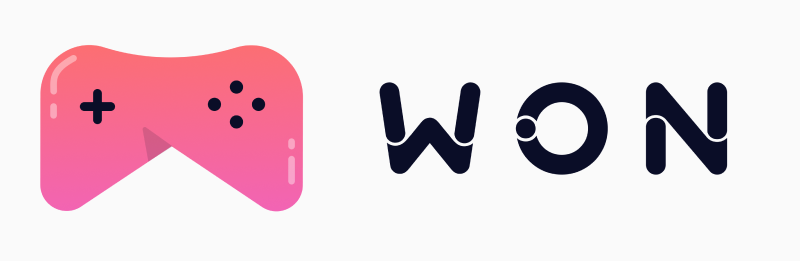
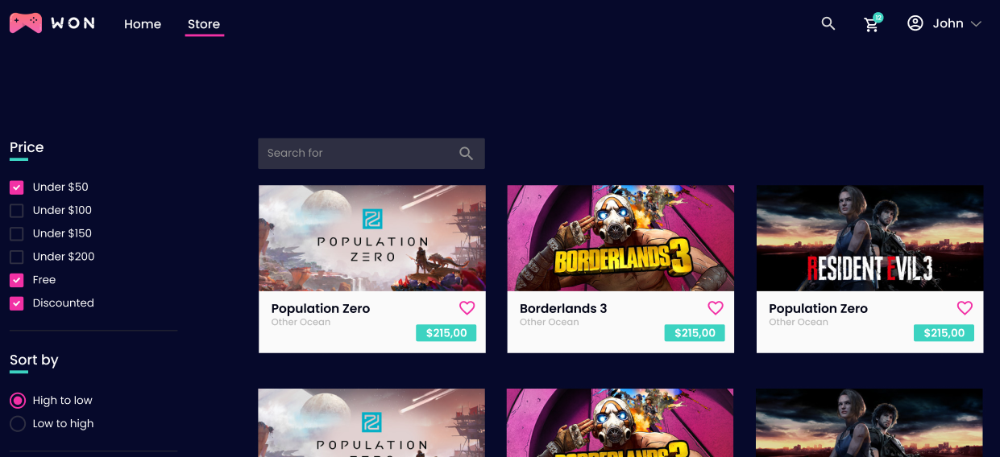

  

 

<h1 align='center'>
 Won Games - CLIENT
</h1>

Plataforma digital para vendas de jogos. O projeto foi desenvolvido no decorrer do curso
  <a href='https://www.udemy.com/course/react-avancado/'>React Avançado - Willian Justen<a />

 

  

 

## ⚡ Stack utilizada(Front-end)

- [NextJS](https://nextjs.org)
- [Typescript](https://www.typescriptlang.org)
- [Styled Components](https://styled-components.com/)
- [Jest](https://jestjs.io)
- [React Testing Library](https://testing-library.com)
- [StoryBook](https://storybook.js.org/)
